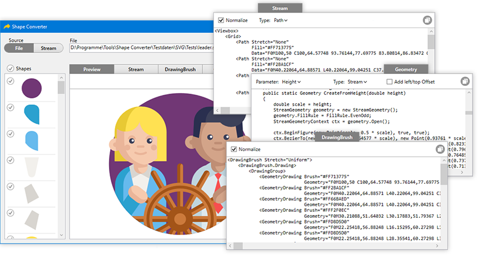

# ShapeConverter
The ShapeConverter converts vector data into WPF/XAML shapes. The main intention is to convert icons and logos you get from your designer so that you can use the icon and logos as vector data in your WPF projects.

##### Supported input file types
* Adobe Illustrator (\*.ai)
* Adobe Photoshop (\*.psd, \*.psb)
* Encapsulated Postscript (\*.eps)
* Scalable Vector Graphic (\*.svg, \*.svgz)

##### Multiple output formats

* StreamGeometry for single color shapes, allows to set the color at runtime
* DrawingBrush for multi color shapes
* C# source code to generate a Geometry with variable dimensions at runtime

##### All input files support

* linear and radial gradients
* transparency (exept EPS) including transparent gradients

##### More features

* the generated data do not contain any transformations
* selectively deselect parts of the shape if the shape consists of multiple shapes
* clipping regions are removed if possible or at least minimized and optimized
* single executable
* show a background checkboard to verify transparencies of the shape
* normalize the coordinates to the range 0..100 (default) to decouple the generated data from the designer's coordinate space

##### Export

* Icon (\*.ico) with all resolutions 16x16, 32x32, 64x64, 128x128, 256x256
* Image (\*.png, \*.jpg, \*.tiff, \*.bmp)
* GIF (\*.gif)
* Scalable Vector Graphic (\*.svg)
* Encapsulated Postscript (\*.eps)

##### The ShapeConverter uses the following open source libraries

* PdfSharp from Stefan Lange, empira Software GmbH
* psd-parser from Ntreev Soft co., Ltd.
